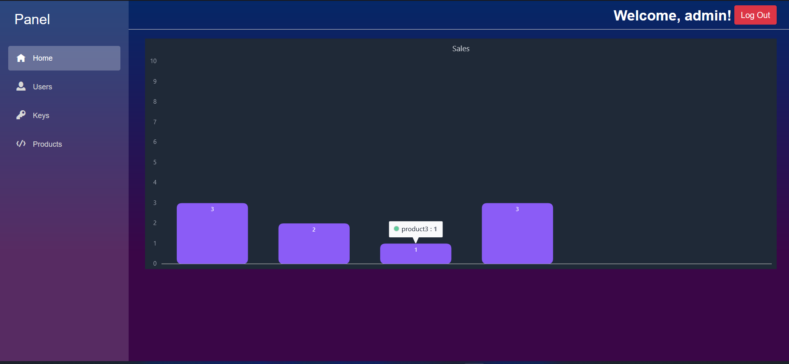

# BlazorProject
This is a simple tool to help you manage licenses for your products.
You can crate new products, create product keys & then use these to validate the product licenses of your clients.

Status: ```On Developement```

[+] The UI


[+] Features
- Build on Blazor web assembly & asp.net core web api
- Build using the repository pattern

- Custom user Register/Login using JWT
- Roles (User, Manager, Admin)
- CRUD operations for Products, Keys, Users
- Upload/Download

[+] To Do
- Build clinet on winForms/WPF